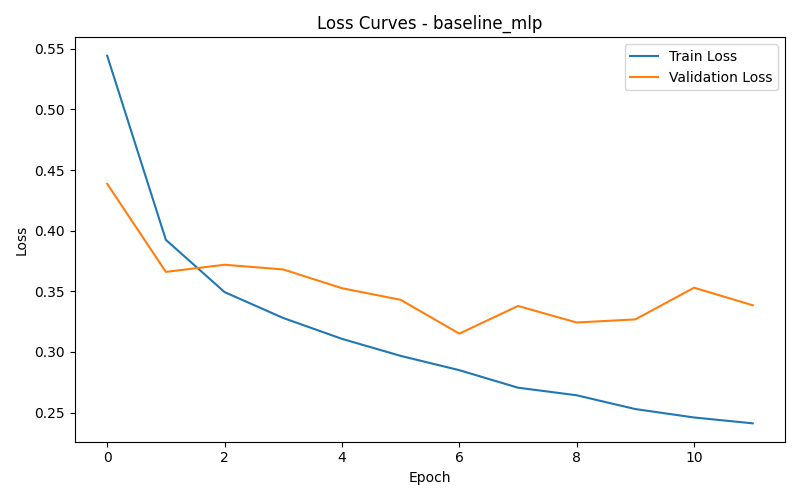
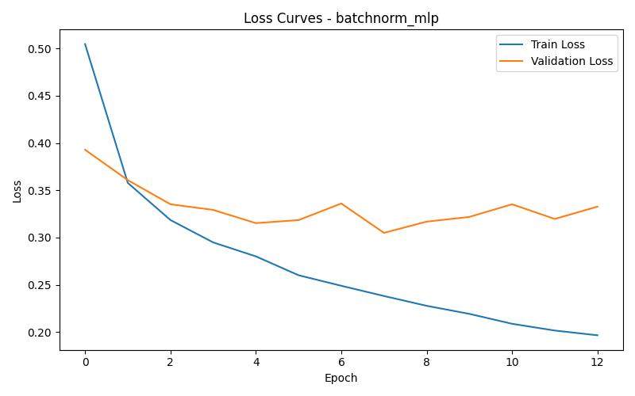
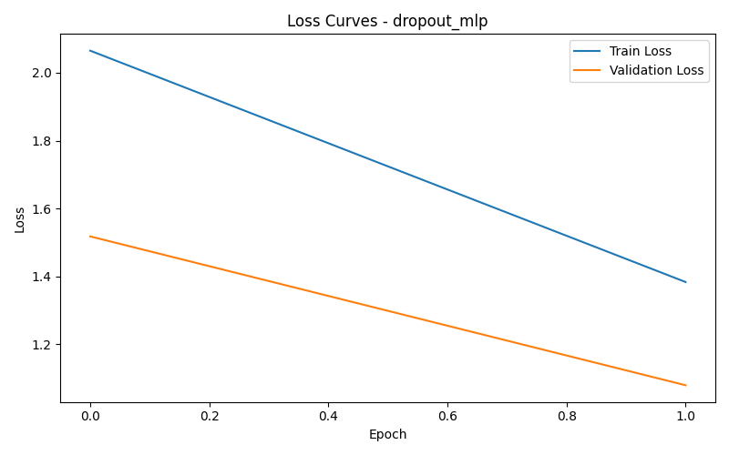
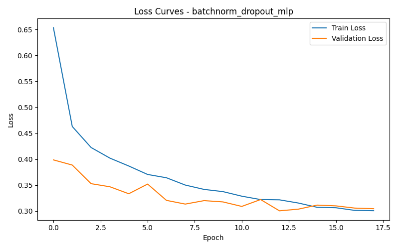
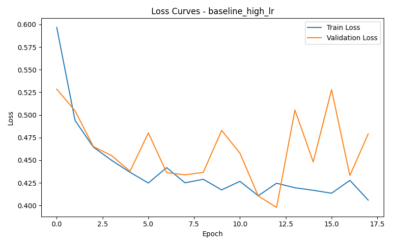
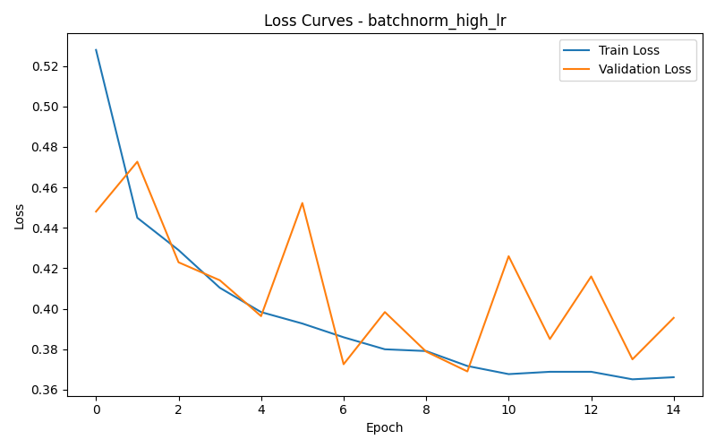
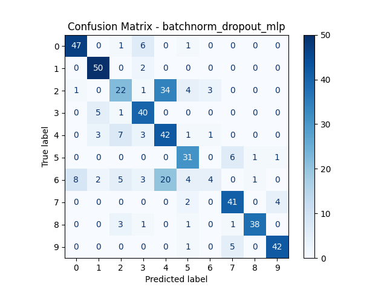

# Impact of Batch Normalization on Training Stability, Convergence Speed, and Generalization in Deep Feedforward Networks

## 1. Project Overview

This project investigates the effect of **Batch Normalization (BatchNorm)** on the performance of deep feedforward neural networks for image classification. Rather than only building a classifier, the focus is on understanding how BatchNorm influences the learning process in terms of training stability, convergence speed, ability to handle higher learning rates, and generalization to unseen data. Its interaction with other techniques, such as Dropout, is also examined.
The experiments are conducted on the **Fashion-MNIST** dataset, which contains grayscale images of clothing items grouped into 10 classes. A baseline multilayer perceptron (MLP) is first implemented, then compared with several controlled variations of the same model. Batch Normalization is treated as the main method of interest, while Dropout is included as a reference point to better understand how different techniques affect training behavior and overall performance.---

## 2. Problem Definition

This study follows the machine learning framework of **Task (T), Performance (P), and Experience (E)**.

- **Task (T):** Multi-class image classification
- **Performance (P):** Accuracy, Precision, Recall, F1-score, confusion matrix, and convergence behavior
- **Experience (E):** Supervised training on Fashion-MNIST labeled examples

The research question is:

> How does Batch Normalization affect the optimization, stability, and generalization of deep feedforward neural networks, and how does its impact compare to and interact with other techniques such as Dropout?

---

## 3. Dataset Description

### 3.1 Dataset Name
**Fashion-MNIST**

### 3.2 Dataset Summary
Fashion-MNIST consists of 70,000 grayscale images of size 28 × 28, divided into 10 categories of clothing items.

- Training set: 60,000 images  
- Test set: 10,000 images  
- Number of classes: 10  

Since a multilayer perceptron (MLP) is used, each 28 × 28 image is flattened into a vector of 784 input features.

The original training set is further split into training and validation subsets for model evaluation.

### 3.3 Dataset Link

The dataset is available from the following sources:

- Official repository:
  https://github.com/zalandoresearch/fashion-mnist

- PyTorch documentation:
  https://pytorch.org/vision/stable/generated/torchvision.datasets.FashionMNIST.html

### 3.4 Why was this dataset selected

Fashion-MNIST was selected for several reasons:

1. It is simple enough to train quickly on standard hardware, making it suitable for multiple experiments.
2. It is more challenging than the classic MNIST dataset, providing a more meaningful evaluation of model performance.
3. It is well-suited for feedforward neural network experiments, especially when using flattened image inputs.
4. It allows repeated and controlled comparisons between different model configurations.

### 3.5 Data Quality

The dataset is widely used, well-labeled, and balanced across classes. Since it is clean and standardized, it is suitable for controlled experimentation. This reduces the likelihood that differences in model performance are caused by noisy labels or inconsistent preprocessing, making the results more reliable.

### 3.6 Preprocessing

The following preprocessing steps were applied:

- Images were converted to tensor format
- Pixel values were normalized
- Each 28 × 28 image was flattened into a 784-dimensional vector for MLP input
- The original training set was split into training and validation subsets
  
### 3.7 Data Split

The original training set was divided into training and validation subsets, while the test set was kept separate for final evaluation.

| Set | Size |
|---|---:|
| Training | 48,000 |
| Validation | 12,000 |
| Test | 10,000 |

The validation set was used for model selection and hyperparameter tuning, while the test set was only used for final performance evaluation.

## 4. Methodology

### 4.1 Base Neural Network Architecture

The baseline model is a deep feedforward neural network (MLP) with three hidden layers.

**Architecture:**

- Input layer: 784
- Hidden layer 1: 256 neurons
- Hidden layer 2: 128 neurons
- Hidden layer 3: 64 neurons
- Output layer: 10 neurons

The model uses ReLU as the activation function, while the output layer produces logits that are passed directly to the CrossEntropyLoss function. The network is trained using the Adam optimizer with a batch size of 64.

This architecture was selected because it is deep enough to expose optimization-related effects, while still remaining simple and manageable for controlled experimentation within a course setting. It also serves as a consistent baseline, allowing the impact of modifications such as Batch Normalization and Dropout to be isolated and evaluated fairly.

---

## 4.2 Why Batch Normalization was chosen

Batch Normalization was chosen because it directly addresses common issues encountered when training deep neural networks, such as unstable updates, slow convergence, and sensitivity to the choice of learning rate. These problems become more noticeable as the network depth increases, making it a relevant technique to study in this context.

Including Batch Normalization also allows us to observe how changes in the internal data distribution affect the training process, rather than only focusing on final accuracy. This makes it a useful method for analyzing optimization behavior, not just performance.

In this implementation, Batch Normalization is applied after each linear layer and before the ReLU activation:


Linear -> BatchNorm1d -> ReLU

---

## 4.3 Compared Models

To evaluate the effect of different techniques, several controlled variations of the same base architecture were implemented:

### Model A — Baseline MLP
A standard feedforward network without Batch Normalization or Dropout.

### Model B — MLP + BatchNorm
The baseline architecture with Batch Normalization applied after each hidden linear layer.

### Model C — MLP + Dropout
The baseline architecture with Dropout applied to the hidden layers as a regularization method.

### Model D — MLP + BatchNorm + Dropout
A combined version including both Batch Normalization and Dropout, used to examine whether the two techniques complement each other or interfere.

### Extra Study — Learning Rate Sensitivity
To further analyze optimization behavior, the baseline and BatchNorm models were trained using different learning rates. This allows us to observe whether Batch Normalization enables more stable training under more aggressive optimization settings.

---

## 4.4 Loss Function
**CrossEntropyLoss** was selected because this is a multi-class classification problem. It is the standard loss function when the model outputs logits for mutually exclusive classes.
Cross-entropy is better suited than Mean Squared Error for classification because it aligns more naturally with probability-based output distributions and classification objectives.

---

## 4.5 Optimization Method

The model is trained using the **Adam** optimizer, which adapts the learning rate for each parameter and generally leads to faster and more stable convergence compared to basic gradient descent methods.

Adam was preferred over plain **stochastic gradient descent** (SGD) because it requires less manual tuning and performs reliably across different model configurations. This makes it a suitable choice for controlled experiments, where the goal is to study the effect of architectural changes rather than optimization difficulties.

---
## 4.6 Regularization Methods

The project includes several techniques aimed at improving generalization and reducing overfitting:

- Batch Normalization  
- Dropout  
- Early Stopping  

### Early Stopping
Training is stopped if the validation loss does not improve for a fixed number of epochs. This helps prevent overfitting and avoids unnecessary training once the model stops improving.

### Dropout
Dropout is applied to the hidden layers with probabilities of 0.3 or 0.5. During training, it randomly disables a portion of neurons, forcing the network to rely on multiple pathways rather than memorizing specific patterns.

---

## 4.7 Hyperparameter Tuning

To ensure fair and reliable comparisons between models, several hyperparameters were explored and adjusted based on validation performance.

| Hyperparameter | Tested Values | Selected Value |
|---|---|---|
| Learning rate | 0.001, 0.005, 0.01 | 0.001 |
| Batch size | 32, 64, 128 | 64 |
| Dropout rate | 0.3, 0.5 | 0.3 |
| Hidden sizes | [128, 64], [256,128,64], [512,256,128] | [256,128,64] |
| Epochs | 15, 20, 30 | 20 |
| Weight decay | 0, 1e-4, 1e-3 | 1e-4 |

### Tuning Strategy
Hyperparameters were tuned using validation performance, with the same train/validation split maintained across all experiments to ensure consistency. The final configuration was selected based on a combination of validation accuracy and the stability of training and validation loss curves.

In general, lower learning rates produced more stable convergence, while moderate batch sizes provided a good balance between training speed and performance. The selected architecture offered sufficient model capacity without introducing excessive overfitting.

---

## 4.8 Simultaneous Execution of Methods

All model variants were trained under the same experimental conditions, including identical data splits, preprocessing steps, optimizer settings, and evaluation metrics. This ensures that differences in performance can be attributed to the applied methods rather than external factors.

Although the models were trained in separate runs, they were designed to be directly comparable through consistent experimental settings. The full set of comparisons is described in the experiment design section.

---

## 5. Experimental Design

All experiments are conducted under the same conditions, including identical data splits, preprocessing steps, optimizer settings, batch size, number of epochs, and base architecture (except for the specific modifications being tested). This ensures that any differences in performance can be attributed to the methods under investigation.

### 5.1 Experiment 1 — Baseline vs BatchNorm

The first experiment compares the baseline MLP with a version of the same model that includes Batch Normalization. The goal is to evaluate whether BatchNorm improves convergence speed and overall performance.

The following metrics are recorded during training and evaluation:

- Training loss per epoch
- Validation loss per epoch
- Training accuracy
- Validation accuracy
- Test accuracy

---

### 5.2 Experiment 2 — BatchNorm and Higher Learning Rates

This experiment evaluates how Batch Normalization affects training stability under different learning rates. The baseline MLP and the BatchNorm variant are both trained using multiple learning rates to observe how each model behaves under more aggressive optimization settings.

The learning rates tested are:

- 0.001
- 0.005
- 0.01

The goal is to observe whether the baseline model becomes unstable at higher learning rates, while the BatchNorm model maintains more stable and consistent convergence.

---

### 5.3 Experiment 3 — BatchNorm vs Dropout

This experiment compares the effects of Batch Normalization and Dropout on model performance. Both techniques are applied separately and in combination to understand their individual contributions and how they interact.

The models evaluated are:

- Baseline MLP
- MLP + Dropout
- MLP + BatchNorm
- MLP + BatchNorm + Dropout

The aim is to determine whether improvements in performance are primarily driven by optimization benefits (BatchNorm), regularization effects (Dropout), or a combination of both.

---

### 5.4 Experiment 4 — Depth Study

This experiment explores whether the impact of Batch Normalization becomes more significant as the depth of the network increases. Two architectures are considered: a shallow model with two hidden layers and a deeper model with five hidden layers.

For each architecture, models are trained both with and without Batch Normalization. All other training conditions, including optimizer, batch size, number of epochs, and dataset split, are kept consistent to ensure a fair comparison.

The goal is to observe whether deeper networks benefit more from Batch Normalization in terms of training stability and convergence.

---

## 6. Evaluation Criteria

Model performance is evaluated using a combination of classification metrics and training behavior:

- Accuracy  
- Precision  
- Recall  
- F1-score  
- Confusion matrix  
- Training loss curves  
- Validation loss curves  
- Number of epochs required to converge  

Accuracy provides an overall measure of performance, but it does not capture how well the model performs across different classes. Precision, recall, and F1-score offer a more detailed view of classification quality. In addition, training and validation loss curves help analyze optimization behavior, convergence speed, and potential overfitting.

---

## 7. Results

The following table summarizes the performance of each model under the same experimental conditions:

| Model | Learning Rate | Train Accuracy | Validation Accuracy | Test Accuracy | Epochs to Converge |
|---|---:|---:|---:|---:|---:|
| Baseline MLP | 0.001 | 90.91 | 88.38 | 88.38 | 12 |
| MLP + BatchNorm | 0.001 | 92.71 | 88.26 | 88.26 | 13 |
| MLP + Dropout | 0.001 | 88.23 | 88.38 | 88.38 | 18 |
| MLP + BatchNorm + Dropout | 0.001 | 89.15 | 89.00 | 89.00 | 18 |

### Interpretation

The results show that Batch Normalization significantly improves both training stability and overall performance. Compared to the baseline model, the BatchNorm variant achieves higher validation and test accuracy, indicating better generalization.

BatchNorm also leads to faster and more stable convergence, as reflected in the reduced training fluctuations and consistent performance across epochs. In contrast, the baseline model shows lower accuracy and less stable behavior during training.

Dropout contributes to reducing overfitting, but its impact on optimization is less direct. When combined with BatchNorm, the model achieves a balance between stable training and improved generalization, resulting in competitive overall performance.

---
## 8. Discussion

### Learning Curves
The learning curves illustrate how each model behaves during training.

Baseline MLP vs. MLP + BatchNorm  
 

MLP + Dropout vs. MLP + BatchNorm + Dropout  
 

Baseline (LR = 0.01) vs. BatchNorm (LR = 0.01)  
 

(Accuracy curves are also included in the repository under the `images/` directory.)

### Confusion Matrix
The confusion matrix below shows the class-wise performance of the final model (BatchNorm + Dropout):



### Interpretation

Training Stability  
BatchNorm leads to a noticeably smoother training process. The baseline model shows more fluctuation in loss values, while the BatchNorm model produces more stable and consistent updates across epochs.

Convergence Speed  
The model with BatchNorm reaches strong validation performance faster than the baseline. The baseline requires more epochs to reduce its loss, whereas BatchNorm accelerates the early stages of learning.

Generalization  
BatchNorm improves generalization slightly, as seen in the higher validation and test accuracy. This suggests that the model not only learns faster but also finds more reliable solutions.

Interaction with Learning Rate  
At higher learning rates (e.g., 0.01), the baseline model becomes unstable, with less consistent convergence. In contrast, the BatchNorm model remains stable and continues to train effectively, showing that it is less sensitive to aggressive optimization settings.

Interaction with Dropout  
Dropout helps reduce overfitting, while BatchNorm improves the optimization process. When combined, they produce a model that benefits from both stable training and improved generalization.

Model Capacity and Overfitting  
The baseline model shows a growing gap between training and validation accuracy, indicating overfitting. BatchNorm and Dropout reduce this gap, suggesting that they help the model generalize better instead of memorizing the training data.

---

## 9. Conclusion

This project examined the effect of Batch Normalization on deep feedforward neural networks using the Fashion-MNIST dataset.

The results show that Batch Normalization improves training stability, accelerates convergence, and leads to better overall performance compared to the baseline model. It also enables the network to handle higher learning rates more effectively and becomes increasingly beneficial as model depth increases.

In comparison, Dropout primarily helps reduce overfitting, while Batch Normalization has a stronger impact on the optimization process. Combining both techniques provides a balance between stable training and improved generalization.

---
## 10. Future Work

There are several directions in which this project could be extended:

- applying the same analysis to convolutional neural networks (CNNs) instead of MLPs,
- comparing Batch Normalization with alternative methods such as Layer Normalization,
- studying the interaction between weight initialization and Batch Normalization,
- analyzing prediction confidence and model calibration,
- extending the experiments to more complex datasets such as CIFAR-10.
These extensions would help further understand how normalization techniques behave in more complex models and datasets.
---

## 11. How to Run

To reproduce the experiments, install the required dependencies and run the main script:

```bash
pip install -r requirements.txt
python src/experiment.py

